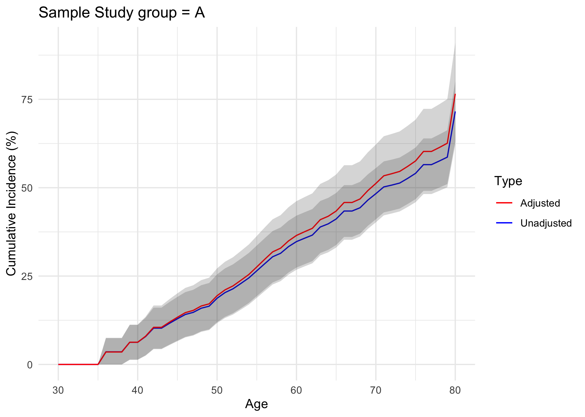

# lifetimeRisk

<div>


</div>

Calculate lifetime risk of adverse outcomes.

## Installation

You can install the development version of `lifetimeRisk` from
[GitHub](https://github.com/) with:

``` r
# install.packages("remotes")
remotes::install_github("msegar/lifetimeRisk")
```

## Get started

``` r
library(lifetimeRisk)
library(dplyr)
library(ggplot2)
```

First we need to generate sample data.

``` r
# Create sample data
set.seed(123)  # For reproducibility
n <- 1000

create_sample_data <- function(n = 1000) {
  data.frame(
    ids = 1:n,
    entryage = round(runif(n, min = 30, max = 70), 0),  # Entry age between 30 and 70
    followup_time = round(runif(n, min = 2, max = 20), 0),  # Follow-up time up to 20 years
    status = rbinom(n, 1, 0.3),  # 30% chance of primary event
    astatus = rbinom(n, 1, 0.2),  # 20% chance of competing event
    group = sample(c("A", "B"), n, replace = TRUE)  # Two groups
  ) %>%
    mutate(
      survage = entryage + followup_time,
      status = ifelse(astatus == 1, 0, status)  # If competing event occurred, primary event didn't
    ) %>%
    select(ids, entryage, survage, status, astatus, group)
}

sample_data <- create_sample_data()
```

`lifetimeRisk` fits the lifetime risk with the `pie()` function.

``` r
# Set parameters
min_age <- 30
max_age <- 80
age_group_width <- 5
group <- "group"
level1 <- "A"
level2 <- "B"
age_free <- 30
o1 <- "plot_group_A.png"
o2 <- "plot_group_B.png"
study_label <- "Sample Study"
min_age_group <- 30

# Run the main pie function
result <- pie(
  data = sample_data,
  min_age = min_age,
  max_age = max_age,
  age_group_width = age_group_width,
  group = group,
  level1 = level1,
  level2 = level2,
  age_free = age_free,
  o1 = o1,
  o2 = o2,
  study_label = study_label,
  min_age_group = min_age_group
)
```

Review results and plot cumulative incidence figures.

``` r
result
#> Lifetime Risk Analysis Results
#> ==============================
#> Study: Sample Study 
#> Group variable: group 
#> Levels compared: A vs B 
#> 
#> Use summary() for detailed lifetime risk estimates.
#> Access full results and plots through the returned object.

# Print summary of results
summary(result)
#> Summary of Lifetime Risk Analysis
#> ==================================
#> Study: Sample Study 
#> Group variable: group 
#> Age range: 30 to 80 years
#> 
#> Results for A 
#> ----------------------------
#> Unadjusted Lifetime Risk: 71.57% (95% CI: 63.11% - 80.03%)
#> Adjusted Lifetime Risk:   76.56% (95% CI: 62.18% - 90.95%)
#> 
#> Results for B 
#> ----------------------------
#> Unadjusted Lifetime Risk: 75.86% (95% CI: 68.74% - 82.98%)
#> Adjusted Lifetime Risk:   74.57% (95% CI: 62.31% - 86.83%)
#> 
#> Note: Adjusted risk accounts for competing risks (e.g., death from other causes).

# Access specific components of the result
result$plots$plot1  # ggplot object for level1
```



``` r

# Export adjusted lifetime risk data for level2
print_lr_data(result, group = "level2", adjusted = TRUE)
#> Age  Risk    LCL UCL 
#> 30   0   0   0
#> 31   0   0   0
#> 32   0   0   0
#> 33   0   0   0
#> 34   0   0   0
#> 35   0   0   0
#> 36   0   0   0
#> 37   0   0   0
#> 38   1.03    0   3.03
#> 39   1.94    0   4.62
#> 40   2.78    0   5.92
#> 41   4.24    0.51    7.96
#> 42   4.24    0.51    7.96
#> 43   6.84    2.35    11.34
#> 44   8.09    3.28    12.91
#> 45   9.3 4.21    14.39
#> 46   9.3 4.21    14.39
#> 47   11.41   5.92    16.9
#> 48   11.93   6.35    17.51
#> 49   12.93   7.18    18.68
#> 50   14.46   8.46    20.46
#> 51   17.46   11.01   23.9
#> 52   18.94   12.29   25.6
#> 53   19.89   13.11   26.67
#> 54   22.24   15.16   29.31
#> 55   24.05   16.75   31.34
#> 56   24.5    17.16   31.85
#> 57   28.01   20.29   35.73
#> 58   29.28   21.43   37.12
#> 59   30.96   22.94   38.97
#> 60   32.19   24.06   40.33
#> 61   33.42   25.17   41.67
#> 62   34.62   26.26   42.97
#> 63   34.62   26.26   42.97
#> 64   36.19   27.7    44.69
#> 65   37.34   28.75   45.93
#> 66   37.7    29.08   46.32
#> 67   38.43   29.76   47.11
#> 68   39.16   30.42   47.89
#> 69   41.28   32.39   50.18
#> 70   44.19   35.09   53.3
#> 71   45  35.82   54.17
#> 72   46.26   36.97   55.54
#> 73   47.16   37.8    56.53
#> 74   48.15   38.68   57.61
#> 75   50.79   41.07   60.52
#> 76   52.59   42.66   62.52
#> 77   53.91   43.82   64
#> 78   56.04   45.68   66.41
#> 79   58.37   47.7    69.05
#> 80   74.57   62.31   86.83
```
